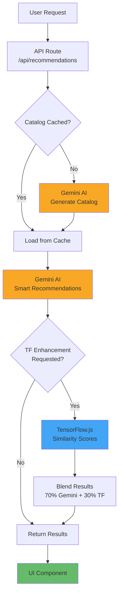

# 🏗️ SellerOps Recommendation Architecture

## Current Architecture (Gemini-First)



## Component Breakdown

### 1. **Frontend Layer** (Green)
- `SmartRecommendationsPanel.tsx`
- User interactions
- Results display
- Catalog refresh control

### 2. **API Layer** (Gray)
- `/api/recommendations` (GET, POST)
- Request validation
- Caching logic
- Response formatting

### 3. **Gemini AI Layer** (Orange) - **PRIMARY**
- `catalog-generator.ts`
- Dynamic catalog generation
- Intelligent recommendations
- Context understanding
- Bundle optimization

### 4. **TensorFlow Layer** (Blue) - **OPTIONAL**
- `recommendation-engine.ts`
- Cosine similarity calculation
- Mathematical enhancement
- Batch operations

### 5. **Storage Layer** (Not Shown)
- In-memory cache (catalogs)
- Redis (signals, separate concern)
- Turso (threats, separate concern)

---

## Data Flow

### GET /api/recommendations
```
Client → API → Check Cache → [Generate if needed] → Return Catalog
```

### POST /api/recommendations
```
Client
  ↓
API (Validate Request)
  ↓
Get Cached Catalog
  ↓
Gemini AI Recommendations (Primary)
  ↓
[Optional] TensorFlow Enhancement
  ↓
Return Enriched Results
  ↓
Client Display
```

---

## Key Design Principles

### 1. **AI-First**
Gemini AI is the primary intelligence engine, not an add-on.

### 2. **Dynamic Data**
No hardcoded products - everything is AI-generated.

### 3. **Optional Enhancement**
TensorFlow adds value but isn't required for core functionality.

### 4. **Caching Strategy**
- Catalog: 1-hour in-memory cache
- Force refresh available via query param
- Minimal API calls, maximum performance

### 5. **Separation of Concerns**
- Gemini: Intelligence & context understanding
- TensorFlow: Mathematical precision
- API: Orchestration & caching
- UI: Presentation & interaction

---

## Performance Characteristics

| Operation | Time | Notes |
|-----------|------|-------|
| First catalog load | ~2-3s | Gemini generation |
| Cached catalog load | <50ms | In-memory |
| Gemini recommendations | ~1-2s | AI processing |
| + TensorFlow enhancement | +1s | Similarity calculations |
| Catalog refresh | ~2-3s | Force regeneration |

---

## Scalability

### Current (MVP)
- In-memory caching
- Single business context
- 10-50 products per catalog

### Future Growth
- Redis/database caching
- Multiple business contexts
- Hundreds of products
- Real inventory integration
- User preference learning

---

## Technology Stack

```
Frontend:   Next.js 16 + React 19 + TypeScript
API:        Next.js API Routes + Zod validation
AI:         Gemini 2.0 Flash (primary) + TensorFlow.js (optional)
Caching:    In-memory (upgradable to Redis)
Styling:    Tailwind CSS + Custom War Room theme
```

---

## Error Handling

```
Gemini API Error
  ↓
Fallback to Gemini 1.5 Flash
  ↓
Still Error?
  ↓
Return error response with details
```

```
TensorFlow Enhancement Error
  ↓
Log warning
  ↓
Continue with pure Gemini results
```

---

## Environment Configuration

### Required
```env
GEMINI_API_KEY=your_key_here
```

### Optional
```env
REDIS_URL=redis://localhost:6379  # For signals (separate feature)
TURSO_DATABASE_URL=file:local.db  # For threats (separate feature)
```

---

## Architecture Advantages

### ✅ Pros
1. **Intelligent** - Gemini understands business context
2. **Dynamic** - No hardcoded data, AI-generated catalogs
3. **Flexible** - Easy to customize for different industries
4. **Scalable** - Caching strategy supports growth
5. **Maintainable** - Clear separation of concerns

### ⚠️ Considerations
1. **API Dependency** - Requires Gemini API access
2. **Cost** - API calls have usage costs (mitigated by caching)
3. **Latency** - First load is slower (2-3s vs instant)

### 🎯 Trade-offs Accepted
- **Static → Dynamic**: Slower first load, but unlimited flexibility
- **Simple → Intelligent**: API dependency, but much better recommendations
- **Free → Paid**: Gemini API costs, but professional-grade AI

---

## Comparison: Old vs New

| Aspect | Before (TF-First) | After (Gemini-First) |
|--------|------------------|---------------------|
| **Primary Engine** | TensorFlow | Gemini AI |
| **Data Source** | Hardcoded | AI-generated |
| **Intelligence** | Similarity math | Context understanding |
| **Flexibility** | Fixed catalog | Dynamic generation |
| **Context Aware** | No | Yes |
| **Bundle Logic** | Basic | Code execution |
| **Refresh** | Manual code change | Click button |
| **Scalability** | Limited | High |

---

## File Structure

```
src/
├── app/
│   └── api/
│       └── recommendations/
│           └── route.ts              # API orchestration
├── components/
│   └── recommendations/
│       └── SmartRecommendationsPanel.tsx  # UI
└── lib/
    ├── gemini/
    │   └── catalog-generator.ts     # PRIMARY AI ENGINE
    └── tensorflow/
        └── recommendation-engine.ts  # OPTIONAL ENHANCEMENT
```

---

## Summary

The new architecture puts **Gemini AI at the center**, treating it as the primary intelligence engine rather than a secondary add-on. TensorFlow becomes an optional mathematical enhancement that can be enabled when needed.

This design:
- ✅ Showcases Gemini's true capabilities
- ✅ Eliminates hardcoded data
- ✅ Provides dynamic, intelligent recommendations
- ✅ Maintains option for TF enhancement
- ✅ Scales to real-world use cases

**Result:** A modern, AI-first recommendation system that's production-ready and impressive.
